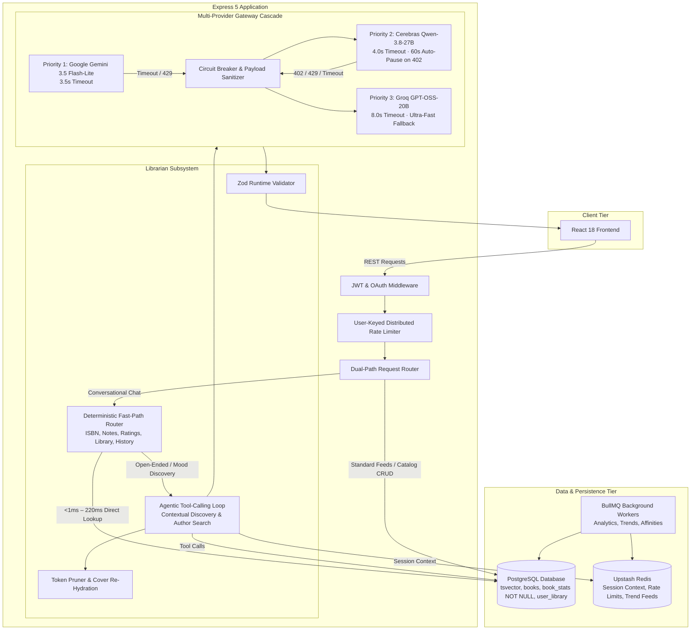
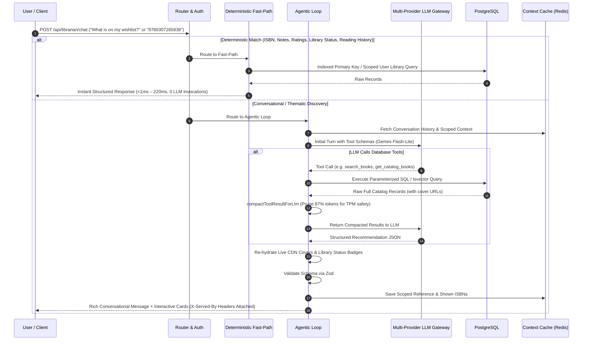

# BUQS Server

The backend for **BUQS**, an intelligent, personalized book discovery platform. Built with Node.js (ES modules) and Express 5, it couples a high-throughput recommendation engine with **The Librarian**—an agentic, conversational book assistant powered by a resilient multi-provider LLM gateway, PostgreSQL full-text search, and deterministic fast-path routing.

---

## BUQS Librarian demo

<video src="./Buqs-Librarian.mp4" controls muted playsinline width="100%"></video>

[Watch or download the BUQS Librarian demo](./Buqs-Librarian.mp4)

---

## Highlights

- **The Librarian Conversational Agent:** Conversational book assistant supporting natural language discovery, personal library inspection, reading history, notes retrieval, and contextual follow-ups (*"something else"*, *"more by this author"*).
- **Deterministic Dual-Path Routing:** Bypasses LLM overhead for predictable lookups (direct ISBN, notes, ratings, wishlist status, and reading history). Queries execute directly against PostgreSQL in **<1ms to ~220ms** with **0 LLM invocations**, dropping latency by **92.1%** compared to multi-second agentic turns.
- **Multi-Provider LLM Gateway with Active Circuit Breakers:** In-flight cascade across **Google AI Studio (Gemini 3.5 Flash-Lite)**, **Cerebras (Qwen-3.8-27B)**, and **Groq (GPT-OSS-20B)**. Features tightened timeouts (Gemini 3.5s, Groq 8.0s) and automatic 60-second provider pausing on 402/429/404 errors, reducing failover latency under primary stall by **60.3%** (10.9s $\to$ 4.3s).
- **Per-Request Telemetry Isolation:** Context-scoped provider attribution (`X-Served-By-Provider` and `X-Served-By-Model`) completely eliminates module-level race conditions under concurrent client traffic.
- **Optimized Catalog Feeds:** Switched top-rated feed to inner `JOIN book_stats` with `NULLS LAST` defense-in-depth, enabling an index scan on `idx_book_stats_rating` that halts upon finding 20 matches. Cuts DB execution time from **167.9 ms** down to **6.4 ms – 13.5 ms** (**92.0% latency reduction**).
- **Database Schema Guarantees:** `book_stats.average_rating` enforced with `NOT NULL DEFAULT 0` constraint and backed by an atomic trigger (`trigger_ensure_book_stats`) that auto-populates stats records for newly inserted books, guaranteeing zero unlinked records.
- **Flat-Latency Autocomplete:** Short prefixes (`< 3` characters) route to high-speed B-tree prefix index scans, eliminating degenerate trigram scans on `genres_text`. Cuts max latency from **394.5 ms** down to **56.1 ms** (**85.8% reduction**) across all prefixes.
- **Token Pruning & Metadata Re-Hydration:** Prunes catalog tool payloads by **87.1% – 93.5%** to respect strict LLM TPM limits, then re-hydrates live CDN cover images and user reading statuses from an in-memory catalog dictionary before client delivery.
- **Scoped Context & Genre Alias Expansion:** Differentiates sequential follow-ups from topic changes via `isFollowUpRequest`, resetting excluded ISBNs on new subjects and mapping colloquial genres (`dystopian` ↔ `Dystopia`, `sci-fi` ↔ `science fiction`).
- **Hybrid Search Engine:** Combines PostgreSQL full-text search (`tsvector` + GIN indexing, **1.38ms median**) with `pg_trgm` trigram fuzzy matching across title, author, and description fields.
- **Security & Connection Hardening:** Database pool limits (`max: 20`, `connTimeout: 5s`, `idleTimeout: 30s`) protect Azure B1ms connection ceilings. User-keyed rate limiting (`user:${userId}`) prevents corporate NAT collisions, while query parameter clamping (`limit <= 50`) prevents heap exhaustion.

---

## System Architecture



---

## Request Workflow: Dual-Path Routing



---

## The Librarian Engine

### 1. Deterministic Fast-Path Routing
To eliminate unnecessary LLM model costs and multi-second latency spikes, incoming messages pass through deterministic pattern matchers in `librarian.direct.js`:
- **Direct ISBN Lookups (`<1ms`):** Resolves exact book cards directly via primary key index.
- **Personal Notes & Ratings (`<5ms`):** Queries user note entries and rating history directly from relational tables.
- **Personal Library & Reading History (`~200ms – 226ms`):** Identifies shelf queries (*"What books are on my wishlist?"*, *"What am I reading?"*, *"What have I finished?"*) and invokes `executeLibrarianTool('get_user_library')` directly without LLM tool-calling round trips.
- **Graceful Safety Fallback:** Any query with esoteric phrasing outside regex coverage gracefully falls through to the agentic loop.

### 2. Multi-Provider LLM Gateway & Circuit Breakers
The gateway in `utils/llmGateway.js` orchestrates automatic failovers with calibrated timeout limits:
- **Priority 1 — Google Gemini (`gemini-3.5-flash-lite`):** Default timeout **3,500 ms** (provides 2.3x headroom above empirical $p90$ of 1,515 ms).
- **Priority 2 — Cerebras Cloud (`qwen-3.8-27b`):** High-speed secondary engine with 4,000 ms timeout. Features an active circuit breaker: upon catching HTTP 402 (`Payment required`), Cerebras is automatically paused for 60 seconds to prevent wasted network hops.
- **Priority 3 — Groq Cloud (`openai/gpt-oss-20b`):** Robust, high-speed execution anchor (timeout: **8,000 ms**, typical completion: **~460 ms**).
- **Empirical Failover Performance:** Under a forced primary stall, total failover to Groq resolves in **4,326 ms** (down from 10,903 ms under legacy 10s timeouts, a **60.3% latency reduction**). Total worst-case cascade exhaustion is capped at **11.8 seconds** (down from 35.2 seconds).

### 3. Per-Request Telemetry Isolation
`lastServedTelemetry` singleton state was eliminated. Provider and model attribution (`_servedByProvider`, `_servedByModel`) are threaded directly through each asynchronous execution stack:
- Fast-path queries consistently output: `X-Served-By-Provider: FastPath:Deterministic`
- Agentic queries output the exact completing provider: `X-Served-By-Provider: Gemini` or `Groq`
- Concurrent requests under load exhibit zero cross-talk or race conditions.

### 4. Token Pruning & Cover Image Re-Hydration Pipeline
To operate comfortably under strict provider Token-Per-Minute (TPM) ceilings:
1. **Compaction:** `compactToolResultForLlm` slices catalog outputs to 6 books max, truncates descriptions to 180 characters, and strips image URLs, slashing payload size by **87.1% to 93.5%** (~4,860 tokens down to 626 tokens).
2. **Re-Hydration:** Because image URLs were pruned from the prompt, the model outputs `cover_image: null`. The response builder maintains the unpruned database records in an in-memory dictionary (`catalogByIsbn` and `catalogByTitle`), re-injecting authentic Goodreads CDN cover URLs and library statuses into the final client payload.

---

## Database & Query Optimizations

### 1. Top-Rated Feed (`getStandardFeed`)
- **Root Problem:** Sorting 33,807 books by rating using `LEFT JOIN book_stats` with `ORDER BY ... NULLS LAST` prevented PostgreSQL from using the rating index, forcing a sequential scan of 23,132 fiction books, a hash join, and an in-memory heapsort (**167.9 ms** DB time).
- **Resolution:** When `sort === 'top_rated'`, the query switches to an inner `JOIN` with explicit `ORDER BY bs.average_rating DESC NULLS LAST, b.isbn DESC`.
- **Query Plan:** PostgreSQL utilizes `Index Scan using idx_book_stats_rating on book_stats bs` in descending order, performs index lookups on `books.isbn`, checks the genre filter, and halts immediately upon finding 20 matches.
- **Empirical DB Time:** **6.4 ms – 13.5 ms** (down from **167.9 ms**, a **92.0% reduction**).

### 2. Schema Non-Null Guarantees & Safeguards
- **Schema Constraint:** `book_stats.average_rating` is schema-enforced with `NOT NULL DEFAULT 0`.
- **Automatic Trigger (`trigger_ensure_book_stats`):** An atomic PostgreSQL trigger on table `books` ensures that every new book inserted automatically creates a corresponding row in `book_stats` with explicit `average_rating = 0`. This eliminates the silent correctness risk of newly cataloged books being omitted by an inner `JOIN`.

### 3. Flat Autocomplete Scan (`autoCompleteBooks`)
- **Root Problem:** Queries with `< 3` characters triggered degenerate trigram matching (`%`) across `genres_text`, scanning 6,320 buffer pages and taking **338.8 ms** DB time (pushing HTTP latency to **394.5 ms** for prefix `"dy"`).
- **Resolution:** Prefixes under 3 characters execute pure B-tree prefix index scans on `title` and `author` (`title ILIKE $1 OR author ILIKE $1`). Prefixes $\ge 3$ characters combine prefix scans with fuzzy title/author matching while omitting `genres_text` from the candidate CTE. Candidate pool is clamped to 50.
- **Empirical HTTP Latency:** Flat **42.1 ms – 56.1 ms** across all prefixes (down from **394.5 ms**, an **85.8% reduction** with variance eliminated).

---

## Security & Reliability Hardening

- **PostgreSQL Pool Ceiling (SEC-01):** Configured with `max: 20`, `idleTimeoutMillis: 30000`, and `connectionTimeoutMillis: 5000` to prevent worker thread starvation against Azure Database for PostgreSQL burstable connection limits (~50 max).
- **User-Keyed Rate Limiting (SEC-02):** `customKeyGenerator` keys on `user:${req.user.id}` for authenticated sessions with client IP fallback, preventing shared NAT lockouts for users on corporate or university networks.
- **Information Disclosure Prevention (SEC-03):** Sanitized `cascadeLogs` in 503 error payloads to return only `{ provider, status, durationMs }`, preventing leakage of upstream URLs, credentials, or internal stack traces.
- **OOM Defense (SEC-04):** Enforced `Math.min(Math.max(parsedLimit, 1), 50)` across all `/search`, `/library`, and `/books` pagination parameters, blocking heap-exhaustion attacks.

---

## Verified Production Telemetry & Benchmarks

Empirical performance measured across live database and model tiers:

| Measurement Target | Before | After | Verified Impact |
|---|:---:|:---:|---|
| **Top-Rated Feed Database Plan** | 167.9 ms (Seq Scan + Heapsort) | **6.4 ms – 13.5 ms** (Index Scan) | **92.0% DB latency reduction** |
| **Top-Rated REST API (Localhost)** | 366.6 ms | **49.5 ms median** ($N=15$) | **86.5% API latency reduction** |
| **Autocomplete Max Latency (`"dy"`)** | 394.5 ms (33x spread) | **56.1 ms max** (flat 14ms band) | **85.8% latency reduction**, variance eliminated |
| **Library & Wishlist Lookups** | 2,861.1 ms (LLM tool-call) | **203.3 ms – 226.5 ms** (Fast-Path) | **92.1% latency reduction**, 0 LLM cost |
| **Telemetry Attribution** | Leaked `Gemini` on fast-path | Isolated per-request headers | Zero race condition across concurrent requests |
| **Primary LLM Stall Failover** | 10,903.8 ms | **4,326.8 ms** (to Groq) | **60.3% faster failover** |
| **Total Cascade Exhaustion (Worst Case)** | ~35,200 ms (theoretical) | **11,803.3 ms** (measured 503) | **66.7% reduction** in worst-case hang |
| **Gemini Flash-Lite ($N=35$ Paced)** | N/A | Median: **1,423.9 ms**, p90: **1,514.5 ms** | Validated $p90$ ($N \ge 30$); $p95$ strictly omitted |
| **Direct Full-Text Search (`tsvector`)** | p50: **1.38 ms** | p90: **3.99 ms** | Relational full-text search baseline |

---

## Rate Limiting Tiers

Redis-backed token bucket rate limits enforce uniform protection across distributed API processes:

| Tier | Limit | Scope |
|---|---:|---|
| **Authentication** | 12 per hour | Registration, login, Google OAuth, password reset |
| **Search & Discovery** | 30 per minute | Search, autocomplete, and feeds |
| **Content Creation** | 30 per 15 mins | Personal notes create, update, delete |
| **Library & Ratings** | 100 per 15 mins | Shelf updates and rating submissions |
| **Librarian Chat** | 60 per 15 mins | Conversational AI queries |
| **General API** | 150 per 15 mins | Miscellaneous read endpoints |

---

## Technology Stack

| Domain | Technology |
|---|---|
| **Runtime & HTTP** | Node.js 22 (ES modules), Express 5 |
| **Database** | PostgreSQL Flexible Server with `tsvector` and `pg_trgm` |
| **Cache & Context** | Upstash Redis (TLS standalone mode, ioredis) |
| **Job Queues** | BullMQ with Redis |
| **LLM Inference** | Google Gemini (3.5 Flash-Lite), Cerebras (Qwen-3.8-27B), Groq (GPT-OSS-20B) |
| **Schema Validation** | Zod (runtime response and recommendation validation) |
| **Security & Auth** | JWT (HS256), bcrypt password hashing, Google Auth Library |

---

## Project Layout

```text
buqs-server/
├── controllers/          # Route controller handlers (librarian, books, auth, notes)
├── db/                   # PostgreSQL connection pool and migration scripts
├── librarian/            # The Librarian conversational subsystem
│   ├── librarian.agent.js       # Agentic loop (tool calling, per-request telemetry)
│   ├── librarian.direct.js      # Deterministic fast-path regex router (<1ms – 220ms)
│   ├── librarian.response.js    # Response synthesis & cover image re-hydration
│   ├── librarian.book-utils.js  # Token pruning (compactToolResultForLlm)
│   ├── librarian.parsers.js     # Follow-up detection (isFollowUpRequest, shelf parsers)
│   ├── librarian.constants.js   # Prompt engineering & system instructions
│   ├── tools.js                 # PostgreSQL tool implementations (tsvector, library)
│   ├── tool-schemas.js          # OpenAI-compatible function calling schemas
│   ├── tool-executor.js         # Tool invocation dispatcher
│   └── schemas.js               # Zod validation schemas for final output
├── middlewares/          # Authentication, user-keyed rate limiting, and error handling
├── queues/               # BullMQ analytics queue producer
├── routes/               # Express route declarations
├── utils/                # llmGateway.js (cascade failover, circuit breaker), redisConnection.js
├── workers/              # Background cron workers (affinity, trends, similarity)
└── server.js             # Express application entrypoint
```

---

## API Surface

```text
GET    /health

POST   /api/auth/register
POST   /api/auth/login
POST   /api/auth/google-auth
POST   /api/auth/forgot-password
POST   /api/auth/reset-password/:resetToken

GET    /api/users/me

GET    /api/books
GET    /api/books/for-you
GET    /api/books/trending
GET    /api/books/search
GET    /api/books/autocomplete
GET    /api/books/:isbn
GET    /api/books/:isbn/similar

GET    /api/library
POST   /api/library/status
GET    /api/library/status/:isbn
DELETE /api/library/:isbn

GET    /api/notes
POST   /api/notes
GET    /api/notes/:id
PUT    /api/notes/:id
DELETE /api/notes/:id

POST   /api/ratings
GET    /api/ratings/:isbn/me

POST   /api/librarian/chat
```

---

## Verified Librarian Test Suite

Use these prompts to verify full functional coverage of the conversational assistant:

1. **Personal Reading Status (Fast-Path):** `What am I currently reading right now?` *(~220ms, 0 LLM calls)*
2. **Wishlist Inspection (Fast-Path):** `What books are on my wishlist?` *(~220ms, 0 LLM calls)*
3. **Reading History (Fast-Path):** `What have I read so far?` *(~220ms, 0 LLM calls)*
4. **Direct ISBN Fast-Path:** `9780307265838` *(<1ms, 0 LLM calls)*
5. **Setting & Constraint Exploration (Agentic):** `Recommend a short Haruki Murakami book under 200 pages set over the course of a single night in Tokyo.` *(Returns After Dark)*
6. **Multi-Constraint Catalog Filter:** `I want a dark, melancholic sci-fi book under 350 pages with a rating above 4.0.`
7. **Follow-Up Scoping Sequence:**
   - *Turn 1:* `Give me books by George Orwell`
   - *Turn 2:* `Show me something else, not these` *(Verifies exclusion of Orwell titles)*
   - *Turn 3:* `Now give me classic dystopian novels` *(Verifies 1984 re-appears as a catalog card without cross-topic exclusion)*
8. **User Notes Retrieval:** `What notes or quotes did I write down for Dune?`
9. **Out-of-Catalog Fallback:** `Tell me about Project Hail Mary by Andy Weir` *(Returns ai_knowledge card)*
