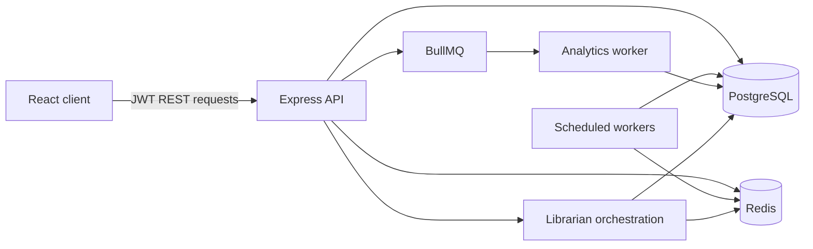
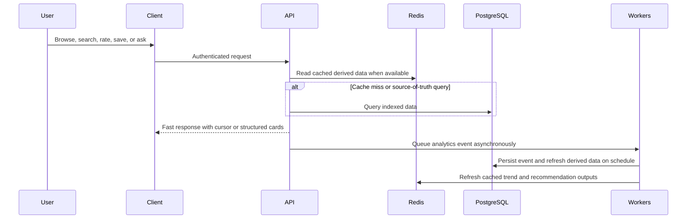
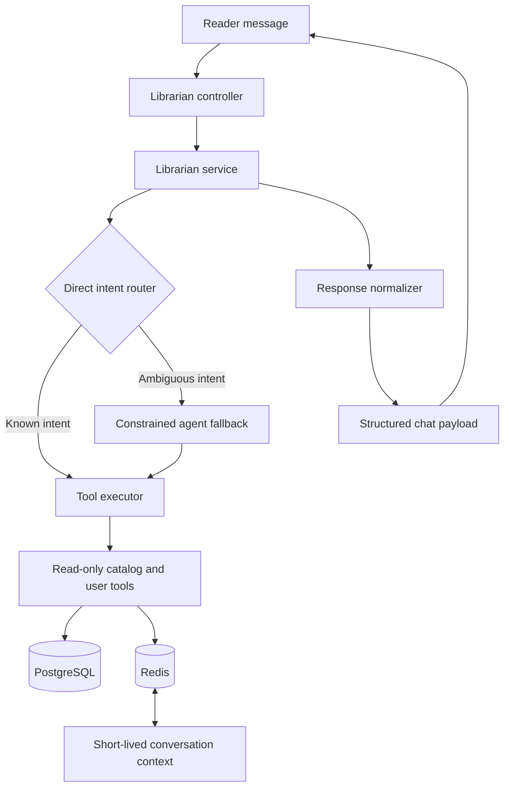
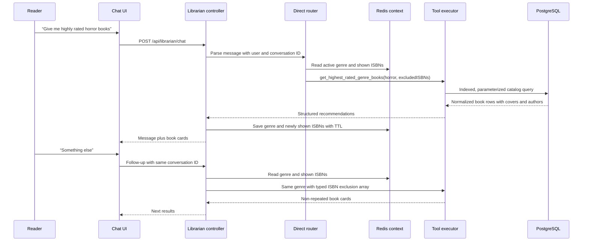
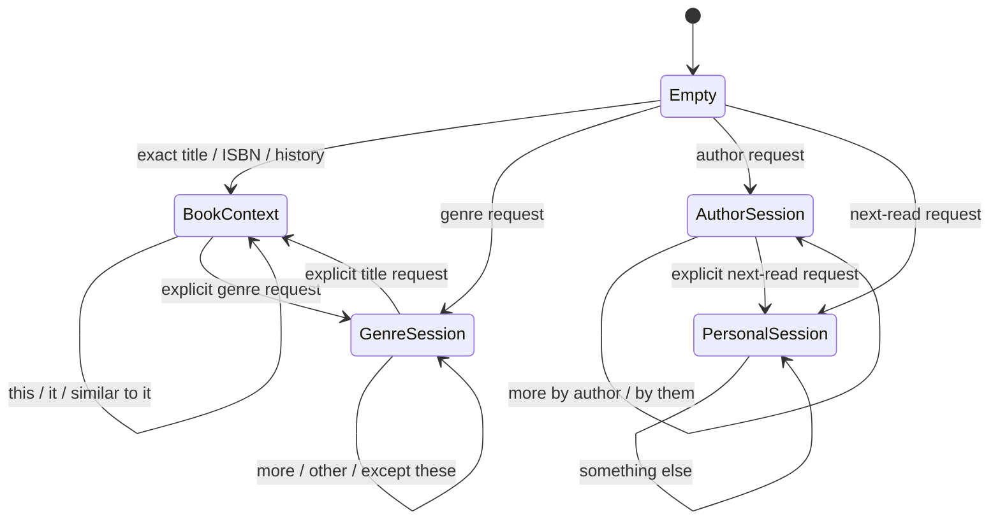

# BUQS Server

The backend for **BUQS**, a personalized book discovery platform. It is a Node.js and Express REST API built around one operating principle: expensive work belongs off the request path. Recommendation candidates, trend scores, taste profiles, analytics, and book-to-book similarity are computed asynchronously, then served quickly through PostgreSQL and Redis.

## BUQS Librarian demo

<video src="./Buqs-Librarian-Demo.mp4" controls muted playsinline width="100%"></video>

[Watch or download the BUQS Librarian demo](./Buqs-Librarian-Demo.mp4)


## Highlights

- Four feed modes: cohort-cached Discovery, personalized For You, precomputed Trending, and sortable catalog browsing
- Per-user genre and author affinity vectors rebuilt every 30 minutes
- Nightly cosine-similarity processing for book-to-book recommendations
- Hybrid PostgreSQL search using full-text ranking and trigram fuzzy matching
- BullMQ analytics pipeline that keeps event writes off the request path
- JWT authentication, bcrypt password hashing, verified Google OAuth, and account linking
- Redis-backed distributed rate limiting with route-specific tiers
- Keyset pagination for feeds and library views
- Personal library, user-scoped notes, and immutable ratings
- The Librarian: a low-latency conversational interface for books, notes, reading history, and follow-up requests such as “something else” or “more by him”

## System architecture



## Request workflow



## Feed system

| Mode | Purpose | How it stays fast |
|---|---|---|
| Discovery | A varied, relevant catalog for broad exploration | Users map deterministically to one of 20 cohorts. Each cohort shares a Redis-cached candidate pool and uses keyset pagination. |
| For You | Personalized recommendations | Reads precomputed genre and author affinities, excludes books already rated or shelved, and falls back to Discovery for cold start. |
| Trending | What is gaining attention now | Reads precomputed trend scores refreshed every 30 minutes with time decay. |
| Standard | Predictable catalog sorting | Uses one keyset strategy per sort order: newest, oldest, rating, and title order. |

All feed queries honor `safe_mode=true` in SQL, rather than filtering after retrieval.

## Search and similarity

Search combines PostgreSQL full-text search (`tsvector` and `websearch_to_tsquery`) with `pg_trgm` fuzzy matching across title, author, and genre data. The result is a single relevance score that supports exact queries, partial matches, and common typos without a separate search service.

The similarity worker stores genre and author feature vectors for books, precomputes vector magnitudes, and calculates cosine similarity. Author overlap receives twice the weight of genre overlap. Adult and non-adult books are never matched, and the best 50 matches per book are stored bidirectionally. Similar-book responses are cached in Redis for 24 hours.

## Background processing

| Worker | Schedule | Responsibility |
|---|---|---|
| Analytics | Queue consumer | Persists activity events and increments denormalized view counters without delaying the originating request. |
| Stats aggregator | Every 30 minutes | Recalculates rating, popularity, momentum, trending score, and base feed score; refreshes Redis trend lists. |
| Affinity aggregator | Every 30 minutes | Rebuilds active users’ author and genre taste weights from weighted recent activity. |
| Similarity aggregator | Daily at 03:00 | Recomputes cosine similarity for recently updated books. |

## The Librarian

The Librarian adds a conversational layer without making every message an expensive model call. Direct intent routing handles common requests first, then structured tools fetch catalog books, notes, ratings, reading history, and ranked genre results. A compact conversation reference tracks the active book, author, genre, notes, and previously shown ISBNs.

### Librarian architecture



The architecture deliberately separates four concerns:

- **Intent recognition:** identifies whether a request is about ratings, history, notes, a title, an author, a genre, a recommendation, or a follow-up.
- **Reference resolution:** resolves phrases such as `it`, `this book`, `him`, `these`, `more`, and `something else` against short-lived context rather than treating them as fresh keyword searches.
- **Tool execution:** reads only the authenticated user’s notes, ratings, library, and catalog data through bounded, parameterized queries.
- **Presentation contract:** turns raw rows into stable `books`, `notes`, and message fields so the frontend can render cards without scraping text.

### Librarian request flow



### Data contract

The endpoint returns structured data rather than embedding the product UI in Markdown. A representative response has a human-readable `message`, optional `books`, optional `notes`, and a stable `conversationId`. Every book item includes an ISBN, title, author string, cover URL when available, and a route-safe URL. Every note item includes its note ID and title. This keeps the API independently testable and prevents client rendering differences between a first response and a later follow-up.

```json
{
  "success": true,
  "data": {
    "conversationId": "uuid",
    "message": "Here are highly rated horror books.",
    "books": [
      {
        "isbn": "9780000000000",
        "title": "Example Book",
        "author": "Example Author",
        "cover_image": "https://...",
        "url": "/books/9780000000000"
      }
    ],
    "notes": []
  }
}
```

### Latency and correctness choices

| Choice | Reason | Tradeoff |
|---|---|---|
| Direct routing before an agent fallback | Common requests avoid model latency and have deterministic behavior. | More intent patterns must be maintained and tested. |
| Redis context with TTL | Follow-ups resolve quickly and context expires naturally. | Context is intentionally non-durable; Redis loss degrades only the conversational reference. |
| Shown-ISBN exclusion | `Something else` produces genuinely new recommendations. | The recent exclusion list is bounded; a very long session needs reset behavior or a durable session store. |
| Structured tool output | Covers, authors, note links, and routes remain consistent. | The response schema must evolve carefully with the client. |
| Read-only tools | The chat cannot mutate ratings, notes, library state, or catalog data. | Actions remain explicit REST mutations elsewhere in the product. |

### Deterministic execution model

Most useful reader requests do not need a generative model. The service first executes a deterministic route for:

| Request family | Example | Data path |
|---|---|---|
| Title or ISBN | `I want to read The Palace of Illusions` | Exact/fuzzy catalog lookup, then exact-title selection when available. |
| Genre browsing | `Show fantasy books` | Dedicated genre query that prioritizes primary-genre matches, preventing broad multi-tag books from dominating unrelated genre requests. |
| Rankings | `Highest-rated poetry books` | Average-rating query with a typed ISBN exclusion array for follow-ups. |
| Personal recommendation | `What should I read next?` | Rated or recently read source book, then precomputed similarity lookup; trending is only a cold-start fallback. |
| Author continuation | `More by Rabindranath Tagore` | Author-only search with previously shown ISBNs excluded. |
| Notes, ratings, history | `Do I have a note about The Lake House?` | Authenticated user-scoped query. |
| Trending | `What is trending?` | The same Redis key family and ranking used by the main Trending feed. |

The constrained tool-agent fallback is retained for ambiguous requests. It can only call allowlisted read tools. It is not allowed to invent catalog IDs, note IDs, routes, or book data; tool output is normalized before it reaches the response builder.

### Conversation-state contract

Redis holds short-lived session state, not permanent chat history. The current bound is 32 transcript messages with a one-hour TTL. The reference object stores the last book, author, genre recommendation, recommendation type, and a bounded list of up to 100 shown ISBNs. That state is sufficient for `this`, `that`, `these`, `more by him`, and `something else`, but it cannot override an explicit new subject. A fresh title, author, genre, note, or ranking request always starts a new deterministic branch.



### Failure behavior

- Redis context unavailable: the request remains functional; only a pronoun-only follow-up loses its reference and receives a clear recovery response.
- Trending cache miss: the Librarian queries the PostgreSQL trending score and refreshes the same Redis key used by the feed.
- Tool returns no rows: the response says that the scoped catalog/user query returned no matches, rather than falling back to unrelated recommendations.
- Agent tool failure: the failure is contained to the request, logged server-side, and never returned as raw database or provider error text.

That enables natural follow-ups while preserving low latency:

```text
Give me some highly rated horror books
Some other horror books
Except these books

Give me books by George Orwell
Which is the highest rated among these?

Tell me about The Palace of Illusions
What else has this author written?
```

Book result cards include title, author, cover image, and route. Note result cards use a note icon and link to the relevant saved note when available.

## Authentication and safety

- Passwords are hashed with bcrypt before storage.
- JWTs use HS256 and are scoped to the user identity.
- Google ID tokens are verified server-side with `google-auth-library`; an existing email is linked rather than duplicated.
- Protected routes validate `Authorization: Bearer <token>` before controller logic runs.
- Password-reset requests use cryptographically random expiring tokens and return a uniform response to avoid account enumeration.
- Notes are always queried with the authenticated `user_id` scope.
- Ratings are validated from 1 through 5 and are immutable once recorded.

## Rate limiting

| Tier | Limit | Scope |
|---|---:|---|
| Authentication | 12 per hour | Registration, login, Google auth, and password reset |
| Search | 30 per minute | Search, autocomplete, and personalized feed |
| Content creation | 30 per 15 minutes | Note creation, update, and deletion |
| Library and ratings | 100 per 15 minutes | Library changes and rating submission |
| General API | 150 per 15 minutes | Remaining routes |

Limits use Redis so enforcement remains consistent across process restarts and multiple API instances.

## Technology

| Area | Technology |
|---|---|
| Runtime | Node.js 22, ES modules |
| HTTP | Express 5 |
| Data | PostgreSQL on Azure Database for PostgreSQL Flexible Server |
| Cache and limits | Redis, ioredis, rate-limit-redis |
| Jobs | BullMQ and node-cron |
| Authentication | jsonwebtoken, bcrypt, google-auth-library |
| Search | PostgreSQL full-text search and pg_trgm |
| Email | Nodemailer with Gmail SMTP |
| Deployment | Azure Web App and GitHub Actions |

## Project layout

```text
buqs-server/
├── controllers/
├── db/
├── librarian/
├── middlewares/
├── queues/
├── routes/
├── utils/
├── workers/
└── server.js
```

## API surface

```text
GET    /health

POST   /api/auth/register
POST   /api/auth/login
POST   /api/auth/google-auth
POST   /api/auth/forgot-password
POST   /api/auth/reset-password/:resetToken

GET    /api/users/me

GET    /api/books
GET    /api/books/for-you
GET    /api/books/trending
GET    /api/books/search
GET    /api/books/autocomplete
GET    /api/books/:isbn
GET    /api/books/:isbn/similar

GET    /api/library
POST   /api/library/status
GET    /api/library/status/:isbn
DELETE /api/library/:isbn

GET    /api/notes
POST   /api/notes
GET    /api/notes/:id
PUT    /api/notes/:id
DELETE /api/notes/:id

POST   /api/ratings
GET    /api/ratings/:isbn/me

POST   /api/librarian/chat
```

## Librarian test prompts

Use these as a quick regression pass after a deployment. Prompts that reference user data require the relevant data to exist for the authenticated account.

1. `What have I rated recently?`
2. `Show me books similar to my last read`
3. `Show some more like this`
4. `Give me books by George Orwell`
5. `Give me the highest rated among these books`
6. `Give me some highly rated horror books`
7. `Some other horror books`
8. `Except these books`
9. `Tell me about The Palace of Illusions by Chitra Banerjee Divakaruni`
10. `What else has this author written?`
11. `Show me my notes`
12. `Do I have a note about The Lake House?`
13. `What should I read next?` followed by `Something else`
14. `Show me fantasy books` followed by `Show more`
15. `I want to read The Palace of Illusions`
16. `More by Rabindranath Tagore`


## Production deployment

The API is deployed to Azure Web App on Linux with Azure Database for PostgreSQL Flexible Server and Azure Managed Redis Enterprise. GitHub Actions deploys every push to `main`, keeping the deployment path repeatable and avoiding manual production changes.

## Technical notes

BUQS is intentionally more than a CRUD project. The implementation demonstrates several production-oriented concerns:

- **Measured database work:** query decisions are validated with `EXPLAIN ANALYZE`; a targeted optimization reduced one measured query from 57.7 ms to 1.26 ms and reduced buffer reads by 96.5%.
- **Explicit consistency model:** catalog and user writes are transactional; trends, affinities, analytics, and similarity edges are asynchronously derived and eventually consistent.
- **Performance-aware pagination:** feeds use keyset cursors instead of large offsets, preserving predictable work as a reader scrolls.
- **Security boundaries:** protected endpoints authenticate before controller work, user-owned resources are scoped by `user_id`, and the Librarian’s tool set is read-only and catalog-grounded.
- **Operational tradeoffs:** Redis improves repeated reads and distributed rate limiting; BullMQ isolates analytics; scheduled derivation avoids expensive synchronous scoring. A larger deployment would run scheduled work in dedicated workers or with leader election rather than every web instance.
