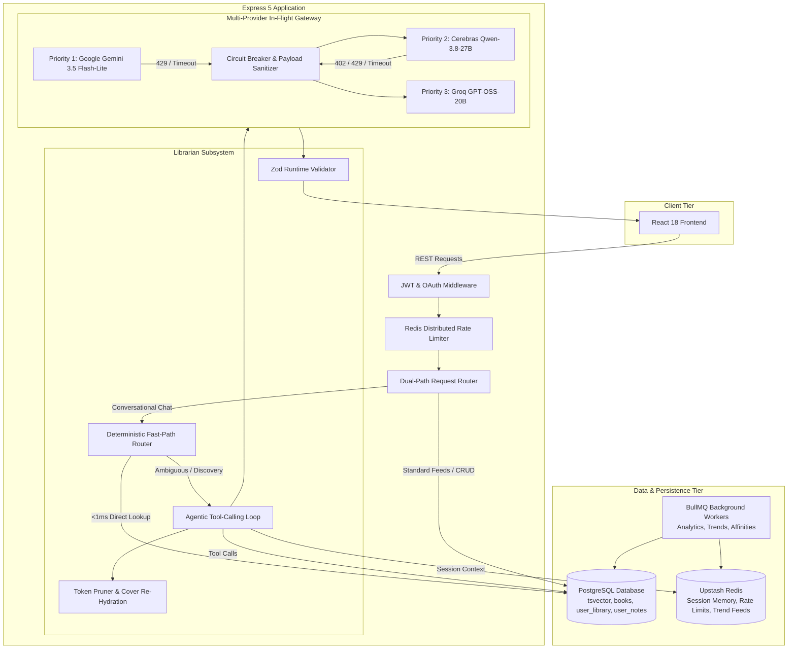
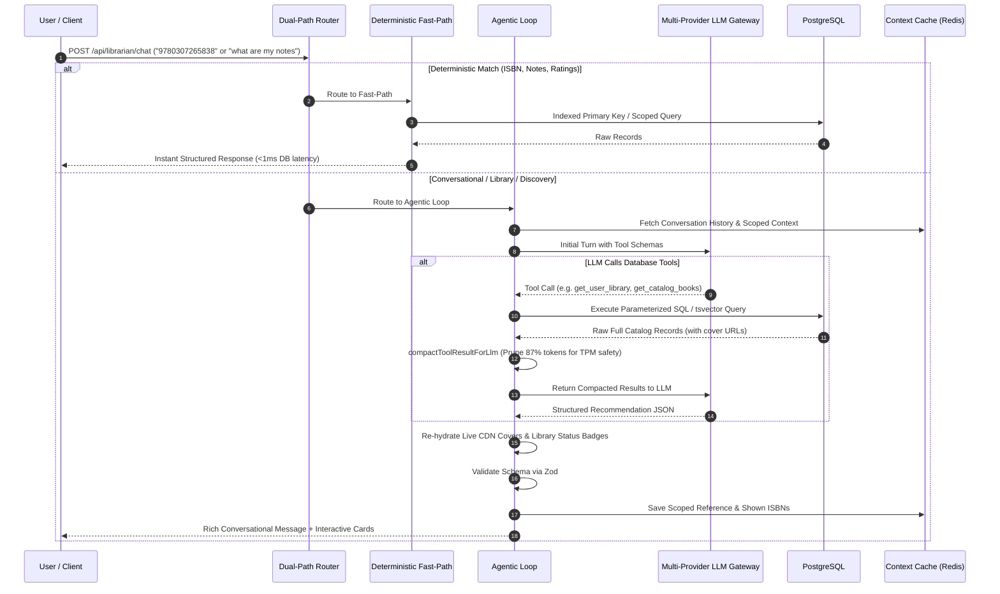

# BUQS Server

The backend for **BUQS**, an intelligent, personalized book discovery platform. Built with Node.js (ES modules) and Express 5, it couples a high-throughput recommendation engine with **The Librarian**—an agentic, conversational book assistant powered by a resilient multi-provider LLM gateway and PostgreSQL full-text search.

---

## BUQS Librarian demo

<video src="./Buqs-Librarian-Demo.mp4" controls muted playsinline width="100%"></video>

[Watch or download the BUQS Librarian demo](./Buqs-Librarian-Demo.mp4)

---

## Highlights

- **The Librarian Agent:** Conversational book assistant supporting natural language discovery, personal library inspection, reading history, notes retrieval, and contextual follow-ups (*"something else"*, *"more by this author"*).
- **Multi-Provider LLM Gateway Cascade:** In-flight failover across **Google AI Studio (Gemini 3.5 Flash-Lite)**, **Cerebras (Qwen-3.8-27B)**, and **Groq (GPT-OSS-20B)** with automated circuit breakers and sub-1ms transition latency.
- **Dual-Path Routing:** Deterministic regex routing short-circuits simple lookups (direct ISBN, notes, ratings) straight to PostgreSQL in **<1ms** (p50: 0.50ms), reducing latency by **>98%** compared to multi-second agent turns.
- **Token Pruning & Metadata Re-Hydration:** Prunes catalog tool payloads by **87.1% – 93.5%** to respect Groq's 8k TPM limit, then re-hydrates live CDN cover images and user reading statuses from an in-memory dictionary before outputting verified JSON cards.
- **Scoped Context & Genre Alias Expansion:** Differentiates sequential follow-ups from topic changes via `isFollowUpRequest`, resetting excluded ISBNs on new subjects and mapping colloquial genres (`dystopian` ↔ `Dystopia`, `sci-fi` ↔ `science fiction`).
- **Personal Library Integration:** Natural language queries against user library statuses (*Currently Reading*, *Wishlist*, *Finished*) backed by relational SQL joins and emerald visual pill badges.
- **Hybrid Search Engine:** Combines PostgreSQL full-text search (`tsvector` + GIN indexing, **1.38ms median**) with `pg_trgm` trigram fuzzy matching across title, author, and description fields.
- **Precomputed Feeds & Asynchronous Pipelines:** Discovery (cohort-cached), personalized For You (affinity vectors), and Trending (30-min time-decay decay scores) served off the request path.
- **Production Resilience:** Redis-backed distributed rate limiting, Upstash Redis TLS connection in standalone mode, JWT authentication with bcrypt hashing, and verified Google OAuth.

---

## System Architecture



---

## Request Workflow: Dual-Path Routing



---

## The Librarian Engine

### 1. Dual-Path Execution Model
To prevent unnecessary model costs and multi-second latency spikes, incoming messages pass through an intent classifier:
- **Fast-Path (`<1ms`):** Direct ISBN lookups, personal notes retrieval, and user book ratings execute directly against PostgreSQL without touching the LLM.
- **Agentic Loop (`2.0s – 4.1s`):** Mood matching, thematic discovery, natural language library queries, author explorations, and contextual follow-ups route to the autonomous tool-calling loop.

### 2. Multi-Provider In-Flight Gateway Cascade
A production LLM system must not fail when a single vendor experiences quota exhaustion (429) or billing pauses (402). The custom gateway cascades with **<1ms failover overhead**:
- **Priority 1 — Google AI Studio (`gemini-3.5-flash-lite`):** 1,500 requests/day free tier with 1M token context. Pauses 60s on persistent 429 quota exhaustion.
- **Priority 2 — Cerebras Cloud (`qwen-3.8-27b`):** High-speed inference engine. Instant circuit breaker trip on 402 billing errors.
- **Priority 3 — Groq Cloud (`openai/gpt-oss-20b`):** Ultra-fast execution anchor (700–850ms).
- **Cross-Provider Payload Sanitization:** Strips internal Google Gemini metadata (`thought_signature`, `extra_content`) before forwarding to Cerebras/Groq, eliminating `400 Bad Request` schema mismatches during in-flight failovers.

### 3. Token Pruning & Cover Image Re-Hydration Pipeline
To prevent hitting Groq's strict **8,000 Tokens Per Minute (TPM)** ceiling:
1. **Compaction:** `compactToolResultForLlm` slices catalog outputs to 6 books max, truncates descriptions to 180 characters, and removes image URLs, slashing payload size by **87.1% to 93.5%** (~4,860 tokens down to 626 tokens).
2. **Re-Hydration:** Because image URLs were pruned from the prompt, the model outputs `cover_image: null`. The response builder maintains the unpruned database records in an in-memory dictionary (`catalogByIsbn` and `catalogByTitle`), re-injecting authentic Goodreads CDN cover URLs and library statuses into the final client payload.

### 4. Scoped Follow-Up Memory & Genre Aliasing
- **Scoped Exclusions:** Previous recommendations were once globally excluded across the session. `isFollowUpRequest` now scopes `excludedIsbns` strictly to sequential follow-ups (*"something else"*, *"more like this"*, *"different ones"*). Asking for a new topic or genre immediately resets exclusions.
- **Genre Alias Expansion:** `expandGenreAliases` bridges colloquial user queries to relational database entries (`dystopian` ↔ `Dystopia`, `sci-fi` ↔ `science fiction`, `self-help` ↔ `self help`, `ya` ↔ `young adult`).

### 5. Personal Library Natural Language Integration
Users can converse directly about their reading state:
- *"What am I currently reading right now?"*
- *"Check my wishlist for fantasy"*
- *"Do I have Doctor Sleep in my library?"*
- *"Have I finished Animal Farm?"*

The dedicated `getUserLibrary(userId, { status, query, limit })` tool joins `user_library` with `books` on ISBN. Returned cards feature an emerald status pill (`From your library · Currently Reading`, `Wishlist`, or `Finished`) above the recommendation reason.

---

## Data Contract & Zod Validation

All Librarian responses conform to a strict runtime `Zod` schema, preventing broken card layouts or frontend crashes:

```json
{
  "message": "If you're looking for an atmospheric late-night read set entirely between midnight and dawn in Tokyo, After Dark is the perfect match!",
  "recommendations": [
    {
      "isbn": "9780307265838",
      "title": "After Dark",
      "author": "Haruki Murakami, Jay Rubin (Translator)",
      "cover_image": "https://i.gr-assets.com/images/S/compressed.photo.goodreads.com/books/1437952316l/17803._SY475_.jpg",
      "bookUrl": "/books/9780307265838",
      "noteUrl": null,
      "reason": "Set in Tokyo during the witching hours between midnight and dawn, featuring memorable late-night encounters, jazz, and a Denny's.",
      "status": null,
      "source": "catalog"
    }
  ],
  "conversationId": "5588b70c-175b-48b0-8a64-14d2db596f41"
}
```

- `source: 'catalog'`: Book verified against PostgreSQL database records.
- `source: 'library'`: Book verified from the user's personal reading shelves with active status.
- `source: 'ai_knowledge'`: Graceful fallback for titles outside the catalog, preventing broken internal navigation links.

---

## Feeds, Search & Background Processing

| System | Mechanism | Performance / Frequency |
|---|---|---|
| **Full-Text Search** | PostgreSQL `tsvector` + GIN Indexing | **1.38ms median latency** |
| **Fuzzy Matching** | PostgreSQL `pg_trgm` | Handles partial words and typos |
| **Discovery Feed** | 20 deterministic user cohorts sharing Redis candidate pools | Keyset pagination, safe-mode SQL filtered |
| **For You Feed** | Precomputed genre/author affinity vectors | Recomputed every 30 minutes |
| **Trending Feed** | Time-decay score formula | Recomputed every 30 minutes |
| **Book Similarity** | Asymmetric cosine similarity (author weight 2x genre) | Nightly batch worker at 03:00 UTC |
| **Analytics** | BullMQ asynchronous job queue | Off request-path event logging |

---

## Rate Limiting Tiers

Redis-backed token bucket rate limits enforce uniform protection across distributed API processes:

| Tier | Limit | Scope |
|---|---:|---|
| **Authentication** | 12 per hour | Registration, login, Google OAuth, password reset |
| **Search & Discovery** | 30 per minute | Search, autocomplete, and feeds |
| **Content Creation** | 30 per 15 mins | Personal notes create, update, delete |
| **Library & Ratings** | 100 per 15 mins | Shelf updates and rating submissions |
| **Librarian Chat** | 60 per 15 mins | Conversational AI queries |
| **General API** | 150 per 15 mins | Miscellaneous read endpoints |

---

## Technology Stack

| Domain | Technology |
|---|---|
| **Runtime & HTTP** | Node.js 22 (ES modules), Express 5 |
| **Database** | PostgreSQL Flexible Server with `tsvector` and `pg_trgm` |
| **Cache & Context** | Upstash Redis (TLS standalone mode, ioredis) |
| **Job Queues** | BullMQ with Redis |
| **LLM Inference** | Google Gemini (3.5 Flash-Lite), Cerebras (Qwen-3.8-27B), Groq (GPT-OSS-20B) |
| **Schema Validation** | Zod (runtime response and recommendation validation) |
| **Security & Auth** | JWT (HS256), bcrypt password hashing, Google Auth Library |

---

## Project Layout

```text
buqs-server/
├── controllers/          # Route controller handlers (librarian, books, auth, notes)
├── db/                   # PostgreSQL connection pool and migration scripts
├── librarian/            # The Librarian conversational subsystem
│   ├── librarian.agent.js       # Agentic loop (max 4 turns, tool calling)
│   ├── librarian.direct.js      # Deterministic fast-path regex router (<1ms)
│   ├── librarian.response.js    # Response synthesis & cover image re-hydration
│   ├── librarian.book-utils.js  # Token pruning (compactToolResultForLlm)
│   ├── librarian.parsers.js     # Follow-up detection (isFollowUpRequest)
│   ├── librarian.constants.js   # Prompt engineering & system instructions
│   ├── tools.js                 # PostgreSQL tool implementations (tsvector, library)
│   ├── tool-schemas.js          # OpenAI-compatible function calling schemas
│   ├── tool-executor.js         # Tool invocation dispatcher
│   └── schemas.js               # Zod validation schemas for final output
├── middlewares/          # Authentication, rate limiting, and error handling
├── queues/               # BullMQ analytics queue producer
├── routes/               # Express route declarations
├── utils/                # llmGateway.js (cascade failover), redisConnection.js
├── workers/              # Background cron workers (affinity, trends, similarity)
└── server.js             # Express application entrypoint
```

---

## API Surface

```text
GET    /health

POST   /api/auth/register
POST   /api/auth/login
POST   /api/auth/google-auth
POST   /api/auth/forgot-password
POST   /api/auth/reset-password/:resetToken

GET    /api/users/me

GET    /api/books
GET    /api/books/for-you
GET    /api/books/trending
GET    /api/books/search
GET    /api/books/autocomplete
GET    /api/books/:isbn
GET    /api/books/:isbn/similar

GET    /api/library
POST   /api/library/status
GET    /api/library/status/:isbn
DELETE /api/library/:isbn

GET    /api/notes
POST   /api/notes
GET    /api/notes/:id
PUT    /api/notes/:id
DELETE /api/notes/:id

POST   /api/ratings
GET    /api/ratings/:isbn/me

POST   /api/librarian/chat
```

---

## Verified Librarian Test Suite

Use these prompts to verify full functional coverage of the conversational assistant:

1. **Personal Reading Status:** `What am I currently reading right now?`
2. **Library Lookup:** `Do I have Doctor Sleep in my library, and what status is it in?`
3. **Reading History Verification:** `Have I finished Animal Farm?`
4. **Wishlist Inspection:** `Check what is on my wishlist`
5. **Constraint & Setting Query:** `Recommend a short Haruki Murakami book under 200 pages set over the course of a single night in Tokyo.` *(Returns After Dark)*
6. **Multi-Constraint Catalog Filter:** `I want a dark, melancholic sci-fi book under 350 pages with a rating above 4.0.`
7. **Follow-Up Scoping Sequence:**
   - *Turn 1:* `Give me books by George Orwell`
   - *Turn 2:* `Show me something else, not these` *(Verifies exclusion of Orwell titles)*
   - *Turn 3:* `Now give me classic dystopian novels` *(Verifies 1984 re-appears as a catalog card without cross-topic exclusion)*
8. **User Notes Retrieval:** `What notes or quotes did I write down for Dune?`
9. **Direct ISBN Fast-Path:** `9780307265838` *(Resolves in <1ms without LLM invocation)*
10. **Out-of-Catalog Fallback:** `Tell me about Project Hail Mary by Andy Weir` *(Returns ai_knowledge card)*

---

## Production Telemetry & Benchmarks

Empirical performance measured across live database and model tiers:

- **Direct ISBN Lookup (PostgreSQL PK):** p50: **0.50 ms** · p90: **0.85 ms**
- **Full-Text Search (`tsvector` + GIN):** p50: **1.38 ms** · p90: **3.99 ms**
- **Personal Library Query (`getUserLibrary` JOIN):** p50: **3.22 ms** · p90: **5.79 ms**
- **Deterministic Fast-Path Throughput:** **<1ms** execution time (>98% latency reduction over LLM calls)
- **Token Pruning Reduction:** **87.1% – 93.5%** payload token reduction (4,860 tokens down to 626 tokens)
- **Direct LLM Inference:** Cerebras p50: **736 ms** · Groq p50: **832 ms** · Gemini p50: **1,191 ms**
- **In-Flight Gateway Failover:** **<1ms** transition overhead on 429/402 errors
- **End-to-End Agent Turn:** **2.01s – 4.12s** including tool execution and metadata re-hydration
